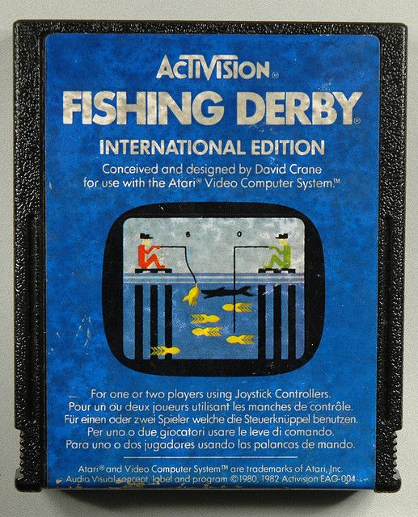

Artificial Intelligence DD2424

Fishing derby: Hidden Markov Models
===

# Objective
The objective of this assignment is to implement Hidden Markov Models (HMM) in order to guess the type of fishes present in the sea.

The solution should be efficient, with a time limit per cycle of 5 seconds. 
The graphical interface spends 0.5 seconds per cycle and waits for player's response if the solution takes longer time.

# Given code
The skeleton provided includes an implementation of the KTH Fishing Derby.
The file player.py is provided, and it is necessary to complete it to solve the game. 

# Instructions
Program a solution in the file player.py by implementing the provided methods.
It is possible to submit the solution in different files if in the end player.py imports them without errors.

# Installation
The code runs in Python 3.6.

You should start with a clean virtual environment and install the requirements for the code to run.

In UNIX, in the skeleton directory, run:

```
$ sudo pip install virtualenvwrapper
$ . /usr/local/bin/virtualenvwrapper.sh
$ mkvirtualenv -p /usr/bin/python3.6 fishingderby
(fishingderby) $ pip install -r requirements.txt
```

In Windows, in the skeleton directory, run:

```
$ pip install virtualenvwrapper-win
```

And then close and open a new terminal.

```
$ mkvirtualenv -p C:\Users\<YourWindowsUser>\AppData\Local\Programs\Python\Python36\bin\python.exe fishingderby
(fishingderby) $ pip install -r requirements_win.txt
```

To run the GUI, in the skeleton's directory, run in the terminal:

```
(fishingderby) $ python main.py < sequences.json
```

# Note

Kattis uses PyPy compiler to run the solutions, which is different from the standard CPython that is used to run this skeleton, 
which unfortunately cannot be run with PyPy. 

You should expect that pure python code might run significantly faster on Kattis than code that uses numpy 
(which does not get compiled well with PyPy).

# Problem E, Fishing derby: HMM
## Game Concept
Though this is a one-person version of the game, the game could also be played in a two-player simultaneous mode and was designed as an Atari TV-video game. The original game was about fishermen reeling in fish, before the local shark could get a hold of them. The first to reach 99 lb. of fish would win. Our Fishing Derby is a generalized version of the old Atari game, where we see an underwater environment with silhouettes of fish swimming, until their species is identified and they become painted in color. The player has to observe the movement patterns of the fish and eventually guess for the correct species. If the guess is correct, the player will gain one point. The game is over when the player has guessed 70 times for different species.



Guessing is optional, you will choose to guess or not for each fish. The score will be unaffected if no guessing is made. You will get to know the correct species for each fish you make a guess on regardless of whether your guess was correct or not.

## Gameplay specifics
The water is considered flat and the fish can move in the eight basic directions (up, down, left, right, up-left, up-right, down-left, down-right). They do not have absolute positions as far as you are concerned. Only the direction of the movement is important. Every fish in the water makes a move for every discrete time step that the game runs (corresponding to one call of guess() in the player file).

The fish have different swimming patterns. A particular species displays only a few swimming patterns and different species may have different variations of them.

The goal of the game is to correctly identify the species of as many fish as possible. The game is divided into several environments. The different environments contain different distributions of fish and the fish may also behave differently in different environments. In particular, the fish will be completely different on Kattis compared to in your sample data.

Each game contains 70 fish and has a maximal duration of 180 time steps. The game will end when the player has made a guess 70 times. The program will be restarted between each game, so you cannot transfer any information between them. The final score is the total number of correctly guessed fish across all environments tested on Kattis.

For more details, please refer to the code inside the provided skeletons.

## Provided code
A basic program will be provided for you in Python. The program, as it is provided, is fully functional, but never guesses.

You should modify the player file and you may also create new files. The files included in the skeleton, other than player.py, may be modified locally but keep in mind that they will be overwritten on Kattis. You only need to upload the player file, and of course any additional python files you have created.

Python code skeleton available in the attachments. You can check the installation instructions in the text file README.md.

In this assignment, the numpy library is available. However, having a lot of numpy operations may severely increase the running time of the program under PyPy compilation, so it is highly suggested to use python lists and self-defined matrix operation instead.

## Input
Your interface with the judge is the player file. A sample input is provided in the code skeleton (sequences.json).

The guess method of the player file will be called for each time step. The number of the iteration and a list containing one movement per fish for the concerned time step are passed as arguments to this function.

The reveal function of the player file is called if a guess is made, and will reveal the species for the fish you made guesses for.

The player should spend less than 5 seconds on each time step before returning a guess, otherwise the evaluation of the code will stop with a run time error.

## Output
The skeleton handles all the output for you. Avoid using stdin and stdout. (Use stderr for debugging.)