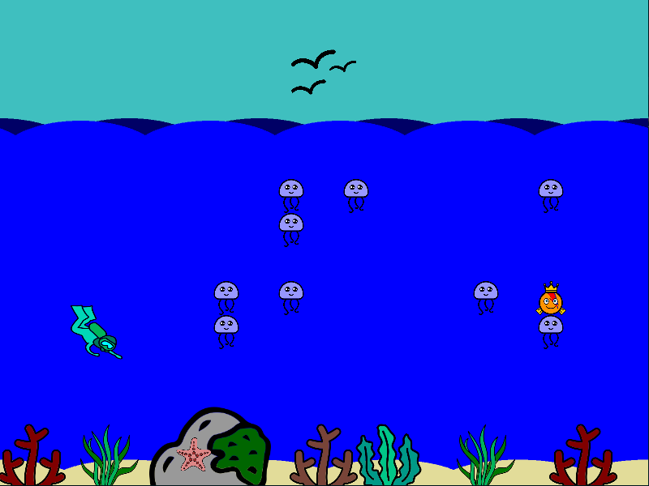
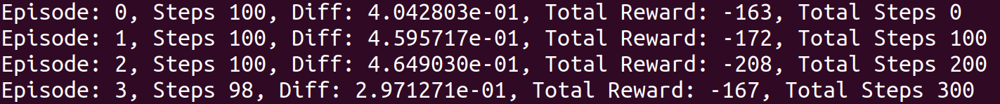

# REINFORCEMENT LEARNING ASSIGNMENT

## Scenario: 
A sea full of jellyfishes, one king fish and one diver.

## Objective:
Capture the king fish. The diver has to reach the king fish while avoiding the jellyfishes. 

## Specifications:
The assignment consists on finding the best policy (Q-learning e-greedy) to reach the king fish 
without touching the jellyfishes. Touching a jellyfish means a discount in the reward while reaching the 
king fish means a positive reward (usually).
The possible actions of the diver are: up, down, left, right.

# Instalation

##  Ubuntu 16.04 / 18.04 / 20.04

### Requirements:
- Anaconda 3 (recommended), you could also use virtualenv as done in the previous assignments.
- a python 3.6/3.7 blank environment (minimum)


##  Instructions with anaconda (from .yml file) [recommended]

0) Open a terminal and unzip the exercise 
1) Move to the repository path in your system 
```
cd [path_to_the_repository]
```
2) Install the anaconda environment from the yml file 
```
conda env create -f rl.yml
```
3) Load the anaconda environment
```
conda activate rl
```


##  Create the environment with anaconda and a  blank python 3.7 env (from requirements.txt)

0) Open a terminal and unzip the exercise 
1) Move to the repository path in your system 
```
cd [path_to_the_repository]
```
2) Create a python 3.7 blank environment (example in anaconda)
```
conda create -n rl python=3.7
```
3) Load the python environment
```
conda activate rl
```
4) Install the required packages thorough pip
```
pip install -r requirements.txt
```

##  Instructions with virtualenv (from requirements.txt)

0) Open a terminal and unzip the exercise 
1) Move to the repository path in your system 
```
cd [path_to_the_repository]
```
2) Install virtualenv and load your python virtual environment
```
sudo pip install virtualenvwrapper
. /usr/local/bin/virtualenvwrapper.sh
mkvirtualenv -p /usr/bin/python3.6 fishingderby
```
3) Install the required packages thorough pip
```
pip install -r requirements.txt
```

## Windows 10
1) Follow the instructions for installing on Ubuntu (or see Tip below)
2) Install additional requirements
```
pip install kivy.deps.sdl2 kivy.deps.glew --extra-index-url https://kivy.org/downloads/packages/simple/
```

## Windows 10 with virtualenv

In Windows, in the skeleton directory, start a terminal in administrator mode (right click) and run:

```
 >pip install virtualenvwrapper-win
```

Close the terminal, and open a new one in the same directory.
The following command will make a new virtual environment for your project. Replace <path/to/python3.6> with 
the path to your python.exe file. Could be something like C:\Users\<Your Windows User>\AppData\Local\Programs\Python\Python36\python.exe
```
 >mkvirtualenv -p {path to Python Interpreter} fishingderby
```
The next command will install the requirements in the virtual environment. Run it in the same terminal as above. 
```
 (fishingderby) >pip install -r requirements_win.txt
```

Now you have a virtual environment with all you need to run the project. To access the virtual environment anytime, 
open a terminal in the directory of the project and type:
```
 >workon fishingderby
``` 

### Tip
Visual Studio allows for creating virtual environments in which you can easily install the requirements.txt. Use the project properties to set your script arguments.

## To run
1) To run your agent once you completed the exercises, execute the following.
```
python main.py settings.yml
```
It will run the agent with the settings in settings.yml

## Assignment:
In order to accomplish the assignment, the student needs to complete the script player.py and other .yml files. 
The student will be able to test locally their agents by running the default settings.yml file.
Most information of the environment is unknown during testing and evaluation. 
To solve the game the student has to program 2 stages:

1) Exploration: Using Q-learning With e-greedy, the student will explore the environment by sending messages to the game
with the following structure:

    msg = {"action": action_str, "exploration": True}
    
    Where: 
    - action can  be: "up", "down", "left" or "right".
    - exploration: Always True during the exploration stage.
    
    After sending this message, the game will respond with a dictionary-message with the next position of the diver and 
    the reward of the action.
    
2) Playing: After finding a policy (reaching a convergence criteria), you can send a message to the game with the following structure;

    msg = {"policy": policy, "exploration": False}
    
    Where:
    - policy: is a dictionary whose keys are the position (x, y) of the map and the values are the actions
     "up", "down", "left" or "right".
    - exploration: Always False for this stage, so the game will understand you want to play and will start moving the diver in the interface. 


# Problem A - RL1 Random Agents
## Game Concept
```txt
In this assignment we take a look at the KTH fishing game. There is one player in this game who is a diver out at sea (see figure 1). You are in command of the diver and your goal is to get the highest score possible, obtained through catching some fishes by avoiding others. The game is over whenever you catch the king fish.
```


## Gameplay specifics
```txt
The diver can move (UP, DOWN, LEFT, RIGHT). There are two types of fish in the game, jelly fish and one single gold fish. There are different (possibly negative) rewards associated with catching each type of fish. The fishes do not move. A fish is caught once its position coincides with the diver’s position. An episode of the game finishes when the king fish is caught.

The position of the fish is not known to the diver. At each time instance, the diver knows it’s own position and when they perform an action, they can observe the immediate reward. The diver goes through multiple episodes of the game with fixed fish positions and the goal for the student is to implement the code for the diver agent that allows it to find a policy that maximizes the reward in the game.

For more details, please refer to the code inside the provided skeletons.
```

## Provided code
```txt
The code skeleton will be provided for you in Python. You should modify the player file player.py and you may also create new files. The files included in the skeleton, other than player.py, may be modified locally but keep in mind that they will be overwritten on Kattis. You only need to upload the player file, and of course any additional python files you have created.

The Python code skeleton is available in the attachments. You can check the installation instructions in the text file README.md.

Your implementation will be called to retrieve the policy that will be used to evaluate your agent in a given scenario. In each step of the learning algorithm, the skeleton queries the environment to receive the reward given the action. Be aware that the judge might sometimes also check different functions of the code. Therefore, you should not modify any function names or input arguments that are provided in the skeleton. Of course, you can extend the class.

The settings.yml also allows you to vary the use of the graphics interface (toggle visualize_exploration).
```
## Input
```txt
Your interface with the judge is the player file player.py. For this first problem, look for a PlayerControllerRandom class within player.py. You will edit the self.random_agent() method within the class. After editing player.py, rename it as player_1.py for submission.

A sample scenario is provided in the code skeleton (the settings.yml file). You are invited to vary the scenario by modifying the settings.yml to test your RL agent on different scenarios.
```
## Output
```txt
The skeleton handles all the output for you. Avoid using stdin and stdout. (Use stderr for debugging.)

You are able to test your random agent by executing: "python main.py settings.yml". You should be able to see messages printed on the standard output (see Figure 2).
```
