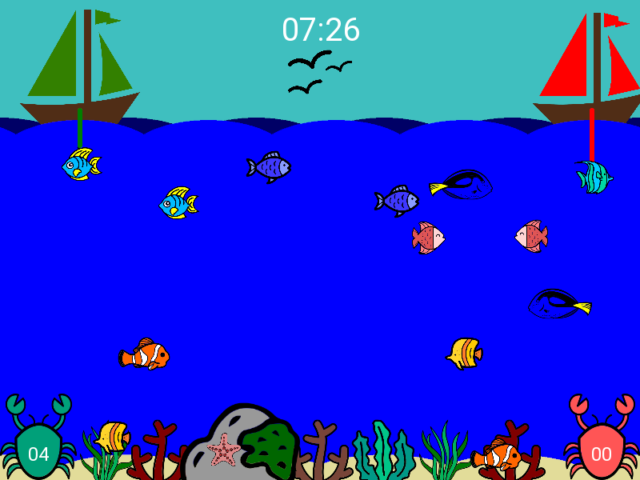

Artificial Intelligence DD2380

A1 - Minimax
===

# Objective
The objective of this assignment is to implement the Minimax search algorithm for the best next
 possible move in the KTH Fishing Derby game tree.

The solution should be efficient, with a time limit per cycle of 75e-3 seconds.

# Instructions
Program a solution in the file player.py in the provided space for doing so. It is possible to submit the solution in
different files if player.py imports correctly and without errors each of them.

# Anaconda Installation and run

You can refer to the following section if you do not have anaconda installed or if you want to keep control of your installation.

Download the skeleton.zip archive and unzip it in the folder of your choice with full path <Skeleton Full Path>.
 
## Installation

Open an anaconda terminal and run the following command:
```
$ conda create -n fishingderby python=3.7
```
Then move to the skeleton directory by using the command
```
$ cd <Skeleton Full Path>
```
Run the command
```
$ pip install -r requirements_win.txt
```
to end the installation.

## Run the program

Open an Anaconda prompt and enter the command
```
$ conda activate fishingderby
$ cd <Skeleton Full Path>
$ python main.py settings.yml
```

# Manual Installation
The code runs in Python 3.7 AMD64 or Python 3.6 AMD64.

You should start with a clean virtual environment and install the
requirements for the code to run.

In UNIX, in the skeleton directory, run:

```
$ sudo pip install virtualenvwrapper
$ export VIRTUALENVWRAPPER_PYTHON=<path/to/python3.X>
$ . /usr/local/bin/virtualenvwrapper.sh
$ mkvirtualenv -p /usr/bin/python3.X fishingderby
(fishingderby) $ pip install -r requirements.txt
```

changing X for 6 or 7, depending if you want to use Python 3.6 or Python 3.7, respectively. In my case, the path to Python 3.X is /usr/bin/python3.X

In Windows, depending on the terminal you are using (this only works in cmd, PowerShell is below)
In the skeleton directory, run:
```
$ pip install virtualenvwrapper-win
```

And then close and open a new terminal.

```
$ mkvirtualenv -p C:\Users\<YourWindowsUser>\AppData\Local\Programs\Python\Python3X\python.exe fishingderby
(fishingderby) $ pip install -r requirements_win.txt
```
changing X for 6 or 7, depending if you want to use Python 3.6 or Python 3.7, respectively.
If the path cannot be found you can use the following command to show your path to the python executable:
```
$ where python
```

If you are using PowerShell as your default terminal the procedure above won't work.
Instead, open PowerShell as admin and type:
```
$ Set-ExecutionPolicy RemoteSigned
```
'Y' for yes then, in the skeleton directory, type:
```
$ pip install venv
$ C:\Users\<YourWindowsUser>\AppData\Local\Programs\Python\Python3X\python.exe -m venv fishingderby
$ .\fishingderby\Scripts\activate
$ (fishingderby) pip install -r .\requirements_win.txt
```
In the second command change X for 6 or 7, depending if you want to use Python 3.6 or Python 3.7, respectively. If the path cannot be found you can use the following command to show your path to the python executable:
```
$ where.exe python
```

In Mac OS X:
1. Install **python 3.7** or **python 3.6**

   https://www.python.org/downloads/mac-osx/

2. Install **virtualenv** and **virtualenvwrapper**

   * Install them with pip3.

   ```undefined
   $ sudo pip3 install virtualenv
   $ sudo pip3 install virtualenvwrapper
   ```

   * Search for the path of **virtualenvwrapper.sh**

   ```
   $ which virtualenvwrapper.sh
   ```

   For example, in my machine, the location of my virtualenvwrapper.sh is `/Library/Frameworks/Python.framework/Versions/3.X/bin/virtualenvwrapper.sh`, where instead of X there is a 6 or a 7, depending if I use Python 3.6 or Python 3.7, respectively.

   * Modify **.bash_profile** file

     Open `/Users/YourUsername/.bash_profile`:

     ```
     $ open -e .bash_profile
     ```

     Append it with:

     ```
     export WORKON_HOME=$HOME/.virtualenvs
     export VIRTUALENVWRAPPER_SCRIPT=/Library/Frameworks/Python.framework/Versions/3.X/bin/virtualenvwrapper.sh
     export VIRTUALENVWRAPPER_PYTHON=/Library/Frameworks/Python.framework/Versions/3.X/bin/python3
     export VIRTUALENVWRAPPER_VIRTUALENV=/Library/Frameworks/Python.framework/Versions/3.X/bin/virtualenv
     source /Library/Frameworks/Python.framework/Versions/3.X/bin/virtualenvwrapper.sh
     ```

     changing X for 6 or 7, depending if you want to use Python 3.6 or Python 3.7, respectively.

     Finally, to make our modification work, type in:

     ```
     $ source .bash_profile
     ```

3. Error debug

   If you have an error like this:

   ```
   [root@r saas]# virtualenv --no-site-packages --python=python3 venv_saas
   usage: virtualenv [--version] [--with-traceback] [-v | -q] [--app-data APP_DATA] [--clear-app-data] [--discovery {builtin}] [-p py] [--creator {builtin,cpython3-posix,venv}] [--se
                     [--activators comma_sep_list] [--clear] [--system-site-packages] [--symlinks | --copies] [--download | --no-download] [--extra-search-dir d [d ...]] [--pip versi
                     [--no-setuptools] [--no-wheel] [--symlink-app-data] [--prompt prompt] [-h]
                     dest
   virtualenv: error: unrecognized arguments: --no-site-packages
   ```

   The problem may be the version of virtualenv. Uninstall the current virtualenv and re-install it with version 16.7.9.

   ```
   $ sudo pip3 uninstall virtualenv
   $ sudo pip3 install virtualenv==16.7.9
   ```

4. Start fishingderby

   ```
   $ . /Library/Frameworks/Python.framework/Versions/3.7/bin/virtualenvwrapper.sh
   $ mkvirtualenv -p /Library/Frameworks/Python.framework/Versions/3.X/bin/python3.X fishingderby
   ```

   changing X for 6 or 7, depending if you want to use Python 3.6 or Python 3.7, respectively.

   **Note:** make sure to find the path of your python 3.6 or python 3.7. You can use `$ which python3.X` to do so. For example, in my machine, the path of my python 3.X is `/Library/Frameworks/Python.framework/Versions/3.X/bin/python3.X`.

   * Go to the skeleton directory and run:

   ```
   (fishingderby) $ pip3 install -r requirements.txt
   ```

# Graphical Interface
To visualize your agent at work and understand the rules of the game better, we added a graphical
interface. You can start with:

```
(fishingderby) $ python3 main.py settings.yml
```

To play yourself using the keyboard (left, right, up, down), change the variable "player_type" in "settings.yml" to the value "human".

Note that can change the scenario of the game! In order to do so change "observations_file" in settings.yml.


# Problem A - Fishing derby: Search
## Game Concept
```txt
In this assignment we take a look at the KTH fishing derby game. The players in this game are two fishing boats out at sea (see Figure 1). Imagine that you are in command of the green boat (on the left) while the red one (on the right) is the opponent. The goal of the game is to get a higher score than the opponent, obtained through catching fish. The game is over either when there are no fish is left or the game time has passed.
```



## Gameplay specifics
```txt
The boats can move horizontally and have a fishing line attached. At the end of the fishing line is a hook which can be moved vertically. Consequently, the possible actions for each player are LEFT, RIGHT, UP, DOWN and STAY. Note that we consider a 20x20 2D scenario, and therefore the boats cannot cross each other. The players take turns while the fish moves at each time step.

The fish can move in the 9 basic directions (UP, DOWN, LEFT, RIGHT, UP-LEFT, UP-RIGHT, DOWN-LEFT, DOWN-RIGHT and STAY). A fish is caught once its position coincides with the hook’s position. Note that some fish are more valuable than others, resulting in different score points per fish. A penalty (negative points) is given for types of fish that should not be caught. The correspondence between the type of fish and number of points is known at the beginning of the game.

The opponent you play against is a minimax opponent capable of reaching large depths, which in the testing scenarios will result in a perfect minimax. But don’t worry! In all scenarios you will be put in a position in which if you perform the right moves, you are guaranteed to win. Therefore, the deciding factor for your victory will be the depth that your algorithm is capable of reaching within the predefined deadline (i.e., how efficient is your minimax implementation) and how well your heuristic characterizes the value of each state.

For more details, please refer to the code inside the provided skeletons.
```
## Provided code
```txt
The code skeleton will be provided for you in Python. You should modify the player file player.py and you may also create new files. The files included in the skeleton, other than player.py, may be modified locally but keep in mind that they will be overwritten on Kattis. You only need to upload the player file, and of course any additional python files you have created.

The Python code skeleton is available in the attachments. You can check the installation instructions in the text file README.md.
```
## Input
```txt
Your interface with the judge is the player file player.py. When it is the your player’s turn, the minimax implementation in player.py will be called determining what the player should do.

The player should spend less than 75 ms on each time step before returning a guess, otherwise the evaluation of the code will stop with a run time error.

Some sample inputs (scenarios) are provided in the code skeleton (the JSON files given in the observations folder). In particular, the input given by test_0.json loads a scenario intended for you to play around with and see how your implementation works. However, the scenario is randomly generated and does not represent how the testing scenarios look like! To get a feeling how the testing scenarios look like (used in Kattis to evaluate your performance), we also include three such scenarios given by test_1.json, test_2.json and test_3.json). These three scenarios have varying difficulty due to the varying depth one needs to have to win. Which scenario is loaded is determined by the file settings.yml.
```
## Output
```txt
The skeleton handles all the output for you. Avoid using stdin and stdout. (Use stderr for debugging.)
```